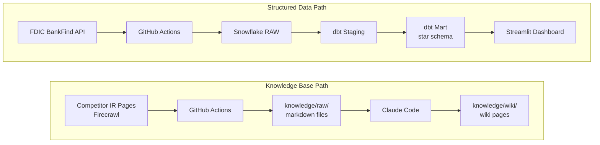
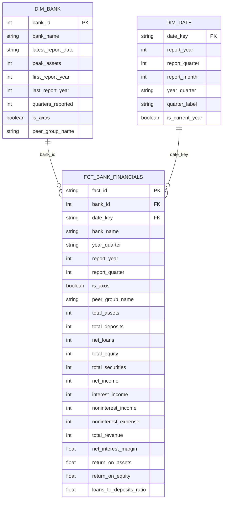

# U.S. Bank Performance & Competitive Intelligence Pipeline

This project builds an end-to-end data pipeline targeting the Jr. Data Analyst role at Axos Bank. It pulls quarterly financial data for all FDIC-insured U.S. banks via the FDIC BankFind Suite API, transforms it through dbt into a star schema in Snowflake, and surfaces bank profitability trends and Axos peer benchmarking in an interactive Streamlit dashboard. A competitive intelligence knowledge base is built from scraped investor relations and about pages across Axos and four digital bank competitors.

## Job Posting

- **Role:** Jr. Data Analyst
- **Company:** Axos Bank
- **Location:** San Diego, CA
- **File:** [`docs/job-posting.pdf`](docs/job-posting.pdf)

This project demonstrates the SQL, Python, dbt, and dashboarding skills the role requires, using real FDIC call report data to build the kind of bank profitability reporting the Axos Commercial Analytics team does day-to-day.

## Tech Stack

| Layer | Tool |
|---|---|
| Source 1 | FDIC BankFind Suite API (REST) |
| Source 2 | Competitor IR pages (Firecrawl web scrape) |
| Data Warehouse | Snowflake |
| Transformation | dbt |
| Orchestration | GitHub Actions |
| Dashboard | Streamlit |
| Knowledge Base | Claude Code (scrape → summarize → query) |

## Pipeline Diagram

## ERD (Star Schema)

## Dashboard Preview

**Live:** https://data-analyst-banking-5yrns7ojcv2cyq5xhyqfru.streamlit.app/

Three-tab interactive dashboard:
- **Axos Overview** — balance sheet growth, ROA/NIM trends, quarterly net income
- **Peer Benchmarking** — Axos vs. Ally, SoFi, LendingClub across any metric
- **Custom Explorer** — pick any bank from 5,000+ FDIC institutions + FDIC industry median overlay

## Key Insights

All figures from FDIC quarterly call reports (2020 Q1 – 2025 Q4).

**Descriptive — What happened?**

Axos Bank grew total assets from $11.5B (Q1 2020) to $27.2B (Q4 2025), a **136% increase in 5 years**, while maintaining a return on assets of **1.77%** — well above the FDIC industry median of 1.10%. Net interest margin held in a tight 4.4–4.9% band throughout, benefiting from Axos's branchless cost structure as rates rose. Annual net income reached **$436M in Q4 2025** (cumulative), up from $226M at end of 2020.

**Diagnostic — Why did it happen?**

Peer benchmarking reveals Axos's efficiency edge:

| Bank | Total Assets | ROA | ROE | NIM |
|---|---|---|---|---|
| Axos Bank | $27.2B | **1.77%** | 17.5% | 4.91% |
| SoFi Bank | $29.7B | 2.90% | 29.6% | 5.69% |
| LendingClub Bank | $11.5B | 1.22% | 10.8% | 6.14% |
| Ally Bank | $184.6B | 0.91% | 11.3% | 4.03% |
| FDIC Industry Median | — | 1.10% | — | 3.72% |

*Q4 2025 snapshot*

Axos consistently outperforms the FDIC median on both ROA and NIM. Ally Bank, despite 7× the assets, earns a lower ROA — a sign that scale alone doesn't drive profitability in digital banking. SoFi leads on ROA and ROE, reflecting rapid loan growth off a smaller base post-bank-charter (2022).

**Recommendation**

Axos's NIM advantage (4.9% vs. 3.7% industry median) is structural — no branch overhead, disciplined deposit pricing. To sustain it as rates normalize, Axos should prioritize **fee-based revenue diversification** (Axos Invest, Axos Clearing) to reduce reliance on rate-sensitive NIM, mirroring SoFi's super-app strategy while staying within Axos's focused product lanes.

## Live Dashboard

**URL:** https://data-analyst-banking-5yrns7ojcv2cyq5xhyqfru.streamlit.app/

## Knowledge Base

A Claude Code-curated wiki built from 10+ scraped sources across 5 digital banks. Wiki pages live in `knowledge/wiki/`, raw sources in `knowledge/raw/`. Browse `knowledge/index.md` to see all pages.

**Query it:** Open Claude Code in this repo and ask questions like:

- "What does the knowledge base say about Axos Bank's competitive position?"
- "How does Axos compare to SoFi and LendingClub based on the wiki?"
- "What themes emerge across our scraped competitor sources?"

Claude Code reads the wiki pages first and falls back to raw sources when needed. See `CLAUDE.md` for the query conventions.

## Setup & Reproduction

**Requirements:** Python 3.12+, Snowflake trial account (AWS US East 1), Firecrawl API key

Copy `.env.example` to `.env` and fill in your credentials:

    SNOWFLAKE_ACCOUNT=
    SNOWFLAKE_USER=
    SNOWFLAKE_PASSWORD=
    SNOWFLAKE_DATABASE=
    SNOWFLAKE_SCHEMA=
    SNOWFLAKE_WAREHOUSE=
    SNOWFLAKE_ROLE=
    FIRECRAWL_API_KEY=

Install dependencies and run:

    pip install -r requirements.txt
    python scripts/extract_fdic.py
    python scripts/scrape_competitors.py

## Repository Structure

    .
    ├── .github/workflows/       # GitHub Actions pipelines
    ├── dbt/                     # dbt models and tests
    ├── docs/                    # Proposal, job posting, slides
    ├── knowledge/
    │   ├── raw/                 # Scraped source files
    │   ├── wiki/                # Claude Code-generated wiki pages
    │   └── index.md             # Index of all wiki pages
    ├── scripts/                 # Extraction scripts
    │   ├── extract_fdic.py      # FDIC API → Snowflake RAW
    │   └── scrape_competitors.py # Competitor scrape → Snowflake RAW + knowledge/raw/
    ├── .env.example             # Required environment variables
    ├── .gitignore
    ├── CLAUDE.md                # Project context for Claude Code
    ├── requirements.txt
    └── README.md                # This file
